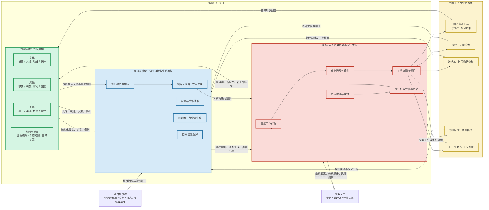

```mermaid
flowchart LR
    U[业务人员
专家 / 管理者 / 运维人员]
    D[项目数据源
业务数据库 / 文档 / 日志 / 传感器数据]
    
    subgraph KE[知识工程项目]
        subgraph KG[知识图谱：知识底座]
            KG1[实体
设备 / 人员 / 项目 / 事件]
            KG2[属性
参数 / 状态 / 时间 / 位置]
            KG3[关系
属于 / 连接 / 依赖 / 导致]
            KG4[规则与推理
业务规则 / 专家规则 / 因果关系]
        end

        subgraph LLM[大语言模型：语义理解与生成引擎]
            L1[自然语言理解]
            L2[实体与关系抽取]
            L3[问题改写与查询生成]
            L4[知识融合与推理]
            L5[答案 / 报告 / 方案生成]
        end

        subgraph AG[AI Agent：任务规划与执行主体]
            A1[理解用户任务]
            A2[任务拆解与规划]
            A3[工具选择与调用]
            A4[结果验证与纠错]
            A5[执行任务并回写结果]
        end
    end

    subgraph TOOLS[外部工具与业务系统]
        T1[图谱查询工具
Cypher / SPARQL]
        T2[文档与向量检索]
        T3[数据库 / 时序数据查询]
        T4[规则引擎 / 预测模型]
        T5[工单 / ERP / CRM系统]
    end

    U -->|自然语言问题或业务任务| AG
    AG -->|最终答案、分析报告、执行结果| U

    D -->|数据抽取与知识加工| LLM
    LLM -->|实体、属性、关系、事件| KG

    KG -->|结构化事实、关系、规则| LLM
    LLM -->|语义理解、查询生成、答案生成| AG

    AG --> A1
    A1 --> A2
    A2 --> A3
    A3 --> T1
    A3 --> T2
    A3 --> T3
    A3 --> T4
    A3 --> T5

    T1 -->|查询知识图谱| KG
    T2 -->|检索文档与案例| LLM
    T3 -->|获取实时与历史数据| LLM
    T4 -->|规则校验与模型分析| LLM
    T5 -->|创建工单或执行流程| AG

    KG -->|提供实体关系与领域知识| L4
    L4 --> L5
    L5 -->|分析结果与建议| AG

    AG --> A4
    A4 --> A5
    A5 -->|新事实、新事件、新工单结果| KG

    KG1 --- KG2
    KG2 --- KG3
    KG3 --- KG4

    classDef kg fill:#D5F5E3,stroke:#229954,stroke-width:2px;
    classDef llm fill:#D6EAF8,stroke:#2874A6,stroke-width:2px;
    classDef agent fill:#FADBD8,stroke:#C0392B,stroke-width:2px;
    classDef tool fill:#FCF3CF,stroke:#B7950B,stroke-width:1.5px;

    class KG,KG1,KG2,KG3,KG4 kg;
    class LLM,L1,L2,L3,L4,L5 llm;
    class AG,A1,A2,A3,A4,A5 agent;
    class TOOLS,T1,T2,T3,T4,T5 tool;
```

